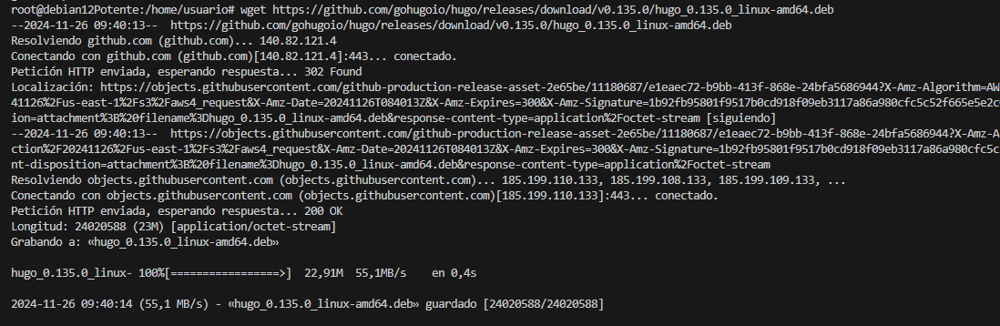
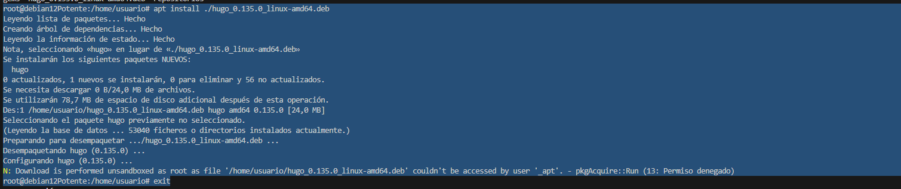
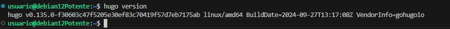
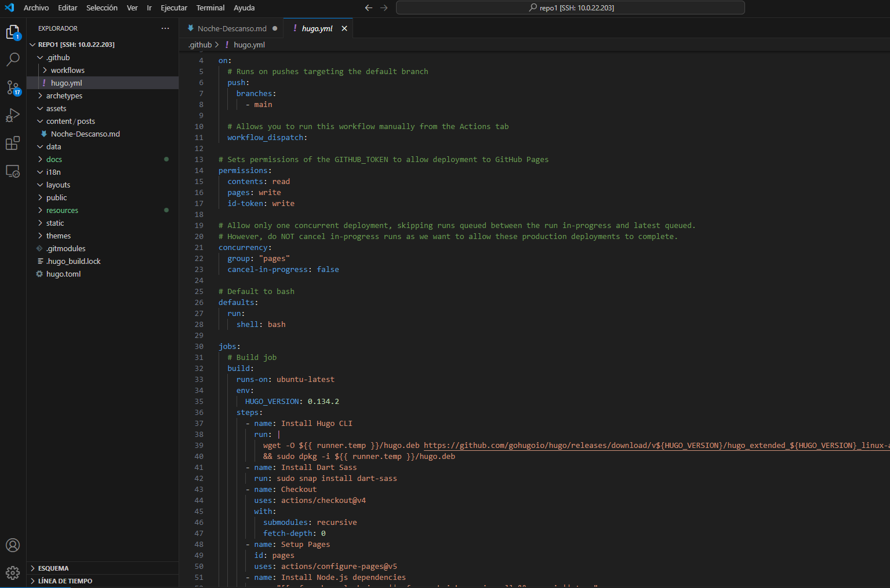
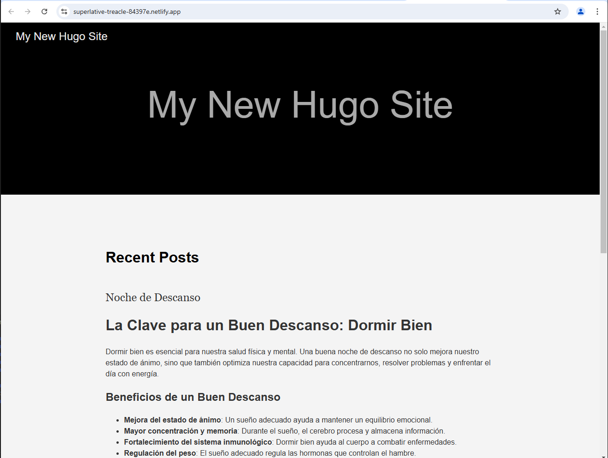
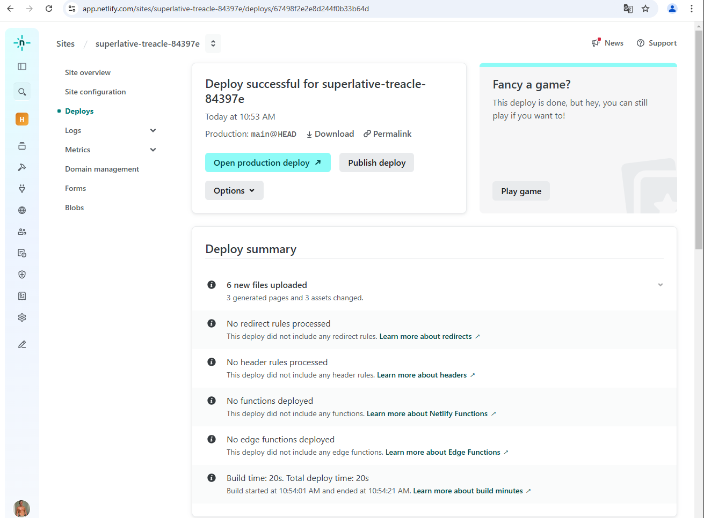
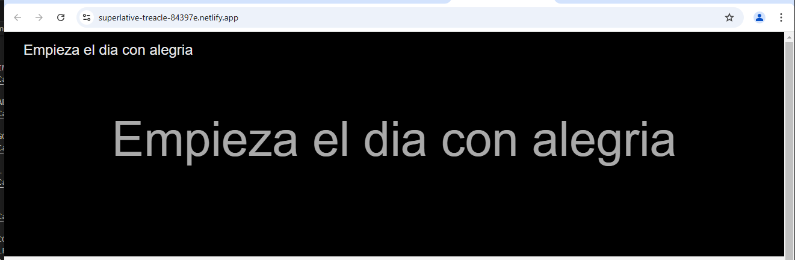

# Hugo Alberto

LO PRIMERO QUE HAREMOS SERA IMPORTAR EL HUGO

INSTALAMOS EL PAQUETE QUE ACABOS DE DESCARGAR

MIRAMOS QUE LA VERSION DE HUGO SEA LA CORRECTA

CREAMOS EL REPOSITORIO CON EL COMANDO "HUGO NEW SITE"

CARGAMOS EL TEMA DE ANANKE

CREAMOS UN POST RELACIONADO CON LO QUE QUEREMOS PONER EN NUESTRO BLOG, EN MI CASO ES SOBRE COMO TENER UN BUEN DIA CON ALEGRIA

SUBIMOS EL SITIO A LOCAL

ESTE ES EL RESULTADO

CREAMOS EL ARCHIVO PARA PODER DESPLEGAR NUESTRA PAGINA EN GITHUB PAGES

ASI SERIA COMO SE VERIA EN GITHUB PAGES

SUBIREMOS NUESTRO SITIO A NETIFLY 

NOS QUEDARA UNA PAGINA TAL QUE ASI: 
